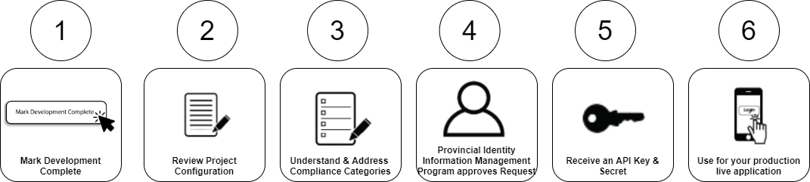

# BCSC-SS
## Project Lifecycle Badge
img - 
The codebase is being roughed out, but finer details are likely to change.

# Vision of BC Services Card Self Service Application:
Our vision is to make it easier for public organizations to offer the widely-used BC Services Card, a secure and verified government issued identity as a login option for online services.

## Hypothesis
Through our partnership with the Exchange Lab, we are working in a new way to deliver value for our Broader Public Sector clients. Our hypothesis is twofold :
1.	Developers want to experiment: If we can provide a user-friendly self-service test environment for BC Services Card login integration,  the IT developer community would be eager to experiment and develop a proof of concept for their agency’s online service

2.	Successful experimentation will lead to production implementation : After our clients have successfully prototyped their application in our test environment, they will engage with the Self Service Application to guide the live/production integration with the BC Services Card login.

## Development
Read the documentation 
[here](DEVELOPMENT.md)

